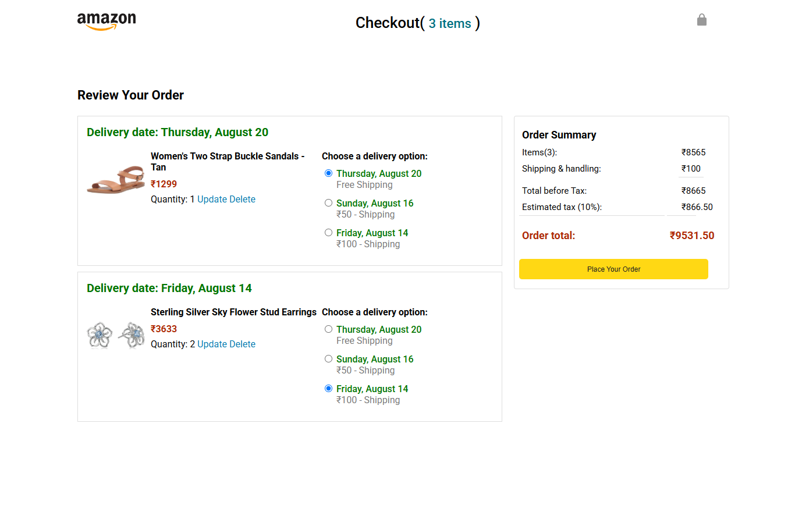
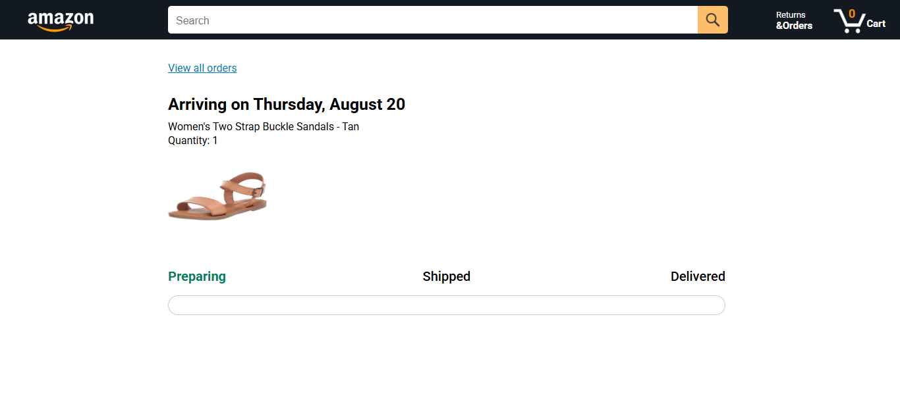

# 🛒 Amazon E-Commerce Clone (Full Frontend Flow)

A feature-complete, multi-page frontend replication of Amazon's core e-commerce ecosystem, featuring dynamic cart management, real-time search filtering, order calculations, and package tracking visualization.

## 🚀 Live Demo
[👉 Click here to experience the Amazon store live!](https://priya-bhagat01.github.io/my_amazon_project/)

## 📸 Application Flow Preview
| Main Store Front | Real-Time Checkout | Order Tracking |
| :---: | :---: | :---: |
|  |  |  |

## 🛠️ Key Technical Features
- **Dynamic Search & Filtering:** Live product filtering via search input with custom state management to handle search results and empty search states ("No products matched").
- **Cart State & Price Engine:** Real-time calculation engine processing sub-totals, delivery options (Free vs Express shipping), 10% tax estimates, and dynamic quantity adjustments (`Update`/`Delete`).
- **Orders & Tracking System:** Functional order summary view generating unique Order IDs, date stamping, and progress status tracking (`Preparing` ➔ `Shipped` ➔ `Delivered`).
- **Multi-Page State Flow:** Seamless user flow spanning store front browsing ➔ interactive cart checkout ➔ order confirmation ➔ item tracking views.

## 🧰 Tech Stack
- HTML5 (Semantic Structure)
- CSS3 (Flexbox & Responsive Grid Layouts)
- JavaScript (ES6 Modules / Local State Management & DOM Manipulation)

## ⚠️ Legal Disclaimer & Fair Use Notice

This project is a **non-commercial, educational clone** of Amazon's front-end user interface. It was built strictly for portfolio purposes to demonstrate web development skills in HTML, CSS, and JavaScript.

* **Intellectual Property:** All rights, logos, brand names, product images, and trademarks associated with **Amazon** belong entirely to **Amazon.com, Inc.** or its affiliates. No copyright infringement is intended.
* **Fair Use:** This repository may contain copyrighted material, the use of which has not always been specifically authorized by the copyright owner. This material is made available under the **"Fair Use"** for educational and training purposes.
* **No Commercialization:** This site is not hosted for commercial use, does not process actual transactions, and does not store real user financial data.
